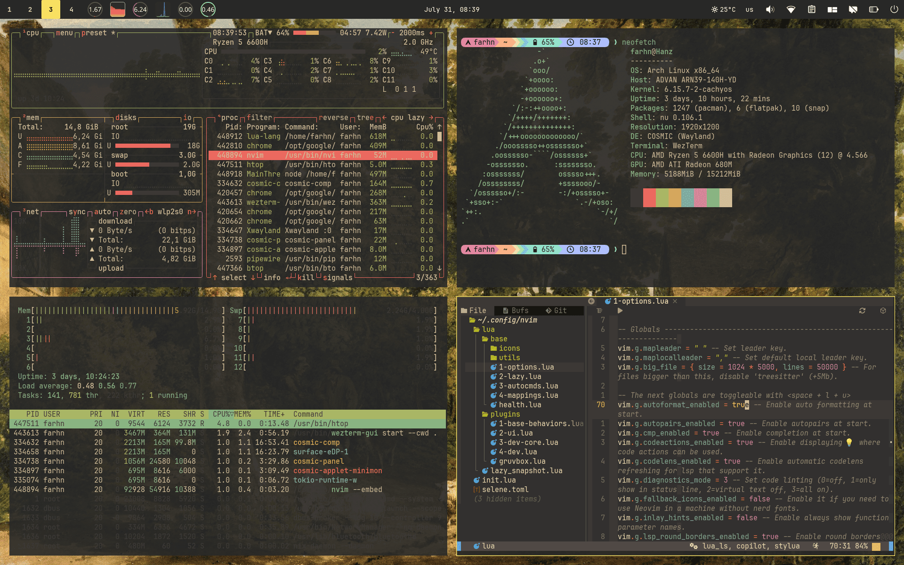

# ArchCOSMIC



This is a script to automate the installation process of the COSMIC desktop
environment on Arch Linux and its derivatives.

## 📍 Requirements

- ✅ `git` installed
- ✅ `base-devel` installed
- ✅ `yay` installed
- ⏺️ (Optional) `chaotic-aur` repo enabled

## 🚀 How To Get Started

1. Clone the repository

```bash
git clone https://github.com/farhnkrnapratma/archcosmic.git
```

2. Navigate to the folder

```bash
cd archcosmic
```

3. Add execution permission for the script

```bash
chmod +x install.sh
```

4. Then, run the script and relax until the process is complete ☕

```bash
./install.sh
```

## 📖 Note

All COSMIC desktop environment packages are installed from the Chaotic-AUR
repository. If you want to use the official version from the Arch Linux
repository, please add the `--arch` argument before running the installation
script.

```bash
./install.sh --arch
```

## 🐞 Report Problems

  Report the issue by opening a pull request or send me an email to
  [farhnkrnapratma@protonmail.com](farhnkrnapratma@protonmail.com)
